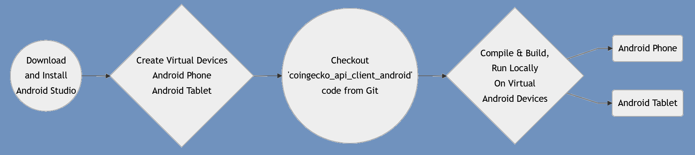
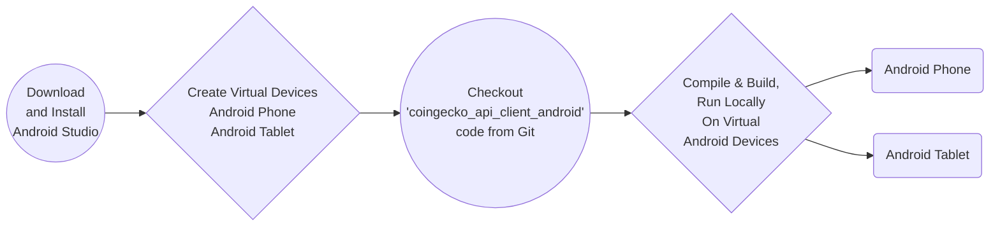

# How to Create Responsive Crypto Market Watch Android Application using Kotlin & CoinGecko API

### Workflow

### Getting Started

<ul>

<li><a href="https://developer.android.com/studio">Android Studio</a></li>

<li><a href="https://developer.android.com/studio/run/managing-avds" target="_new">Create Android Virtual Devices</a></li>

<li>Checkout <a href="https://github.com/lalumastan/coingecko_api_client_android.git">this code</a> from Github</li>

<li>Compile & Build, Run Locally on Virtual Android Devices (i.e. Phone, Tablet etc.)</li>
</ul>

### References

<ul>

<li><a href="https://developer.android.com/codelabs/basic-android-kotlin-compose-first-app#0">Android Tutorial</a></li>

<li><a href="https://www.coingecko.com/api/documentation">CoinGecko API Documentation</a></li>

</ul>

### Tutorial

